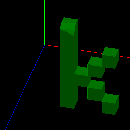
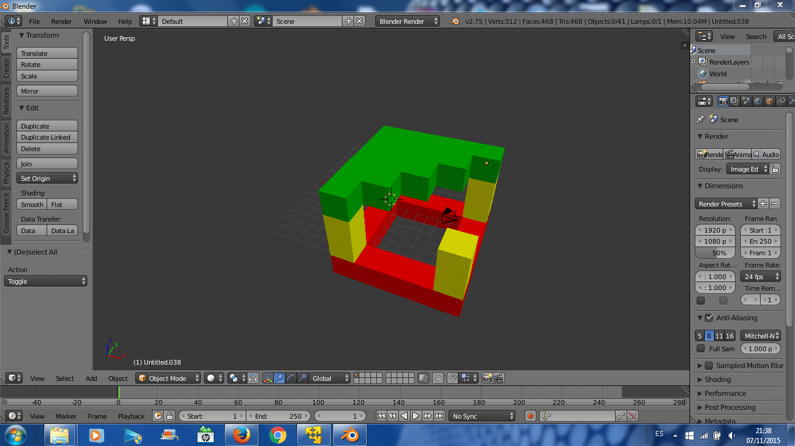
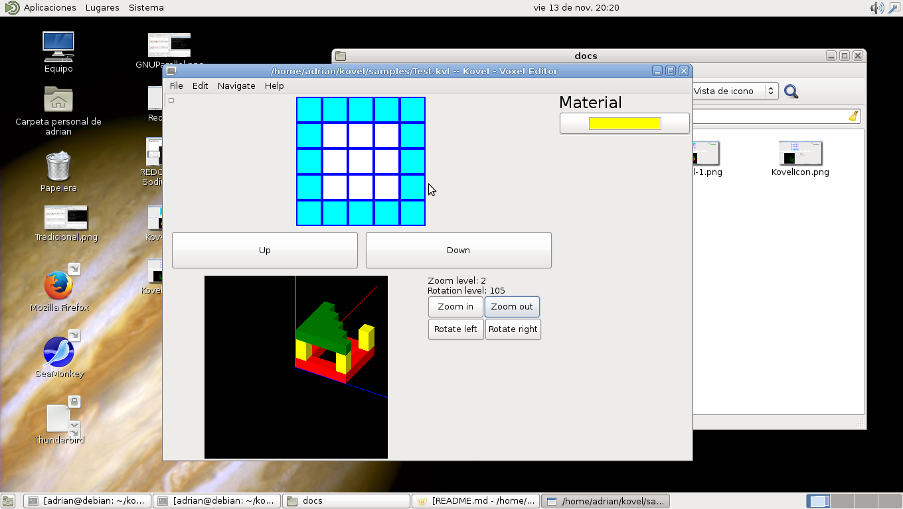
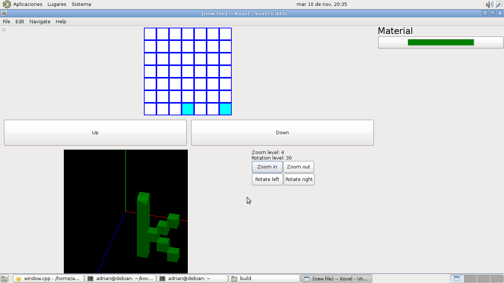

# Kovel




Welcome! Kovel is a 3D voxel editor for Linux and Windows. Create fantastic models without knowledge. Just fill the grid with your colors! Save your models in Kovel file (*.kvl) or in [COLLADA DAE](https://www.khronos.org/collada/) (only export).
See changes in your models in realtime, rotate and scale. Kovel also has infinite undo history (in a same file). Kovel has a command line tool (kovelcli) to automate your work pipeline. Convert all your Kovel files into Collada DAE in a few commands.

## Building

Kovel requires:

 * wxWidgets 3.0 or higher
 * CMake 3.2 or higher
 * OpenGL (current renderer uses OpenGL 1.0 legacy API, so everything works)
 * C++11 compiler (lambda support)
 * libbson - in tree
 
#### Get the source

```
git clone https://github.com/AdrianArroyoCalle/kovel
cd kovel
git submodule init
git submodule update
```

#### Debian/Ubuntu

```
sudo apt install cmake g++ libwxgtk3.0-dev libwxbase3.0-dev wx3.0-headers wx-common
```

If you want to run the little test suite, you also need:

```
sudo apt install libxml2-utils python

```

Configure and compile

```
mkdir build
cd build
cmake .. -DWX_UI=ON
make
```

Native package:

```
dpkg-buildpackage -rfakeroot -kYOUR_GPG_KEY
```

Tests:

```
cd test
./test_dae.sh
./test_json.sh
```

#### Windows

```
# AS ADMIN USER
choco install 7zip.commandline
```

```
mkdir wx
cd wx
wget -OutFile wxWidgets-3.0.2_headers.7z https://github.com/wxWidgets/wxWidgets/releases/download/v3.0.2/wxWidgets-3.0.2_headers.7z
wget -OutFile wxMSW-3.0.2_vc120_x64_Dev.7z https://github.com/wxWidgets/wxWidgets/releases/download/v3.0.2/wxMSW-3.0.2_vc120_x64_Dev.7z
# Change vc120 for your Visual Studio version and choose between x86 and x64.
7z x *.7z
cmake . -G "Visual Studio 12 2013 Win64" -DWX_UI=ON -DwxWidgets_ROOT_DIR="C:\kovel\wx" -DwxWidgets_LIB_DIR="C:\kovel\wx\lib\vc120_x64_dll" && exit 0
```

Open the Visual Studio solution and build ALL_BUILD

## Getting it

Launchpad PPA:

```
sudo add-apt-repository -y ppa:adrian-arroyocalle/kovel
sudo apt update
sudo apt install kovel kovel-cli
```

## Screenshoots






## Donate

PayPal: http://paypal.me/aarroyoc
BitCoin: 1A2j8CwiFEhQ4Uycsjhr3gQPbJxFk1LRmM

## Command line usage

|Flag|Description|
|--|-------------|
|-h|Show help|
|-i|Input file|
|-x|Export as (dae,json)|
|-o|Out file|

Example (export as COLLADA DAE)
```
kovelcli -i File.kvl -x dae -o File.dae
```


